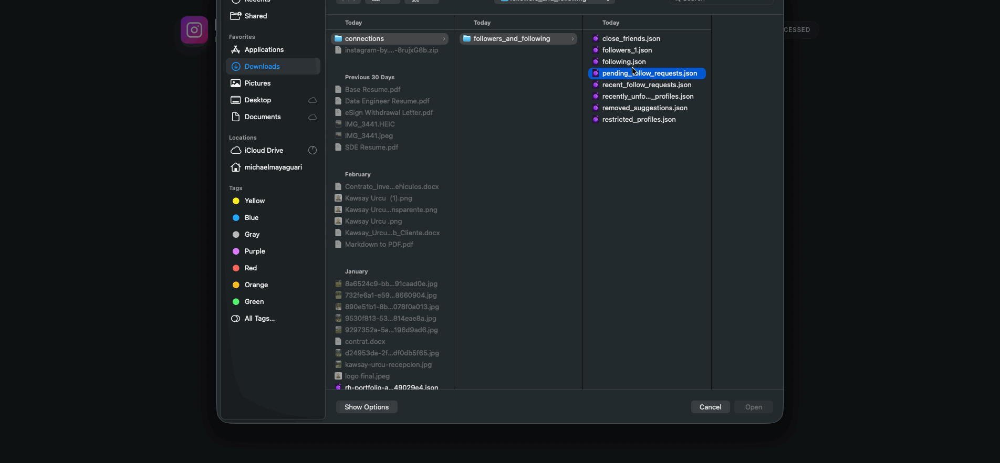

# Who Is Not Following Me Back (AI-Powered)

Professional Instagram data integrity engine designed to process local JSON exports and identify "Non-Followers" with precision.

## 🚀 Core Technology
Built on **Gemini 1.5 Pro** using "Zero-Footprint Personalization" logic. This application leverages advanced LLM capabilities to categorize account types (Brands, Figures, Individuals) beyond simple string matching.

## 🔒 Privacy First
- **Local Processing**: Your data never leaves your machine for storage. JSON files are processed entirely within the browser's memory.
- **No Credentials**: Unlike "follower apps" that risk your account security, this auditor requires **zero** passwords or OAuth access to your Instagram account.
- **Secure Analysis**: AI categorization is performed on anonymized username lists, ensuring your private connection data remains private.

## 🛠 Robust Logic
The engine utilizes a deep-scan matching protocol:
1. **Relational Sync**: Cross-references `following.json` (titles) against `followers.json` (string_list_data).
2. **Metadata Extraction**: Identifies usernames hidden within nested JSON structures and URL `href` metadata that standard auditors often miss.
3. **Cleanse Protocol**: Automatically ignores system-generated strings (`_u`, `instagram`, etc.) to provide a clean, actionable list.

## 💎 Value Proposition
Perfect for professional cleanups. By separating **News & Brands** from **Personal Connections**, you can make informed decisions about your digital environment without accidentally unfollowing close friends or important informational outlets.

## 🪧 Demo

---
*Created with Google AI Studio Build.*
